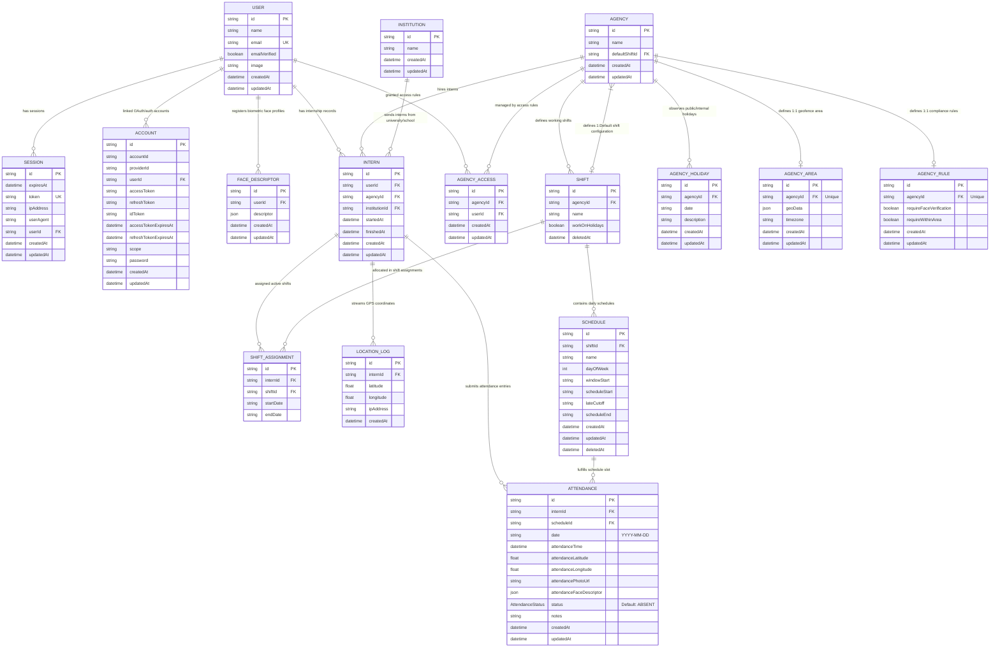

# Database Entity Relationship Diagram (ERD) & Relation Audit

Dokumen ini berisi pemetaan relasi antar tabel (Entity Relationship Diagram) menggunakan Mermaid syntax, serta hasil audit terhadap struktur relasi database PostgreSQL yang didefinisikan dalam [schema.prisma](file:///d:/Intern%20Pangeran/coding-absensi-bebas/diskominfo-intern-attendance/prisma/schema.prisma).

---

## 1. 📊 Entity Relationship Diagram (ERD)

Diagram di bawah ini menggambarkan entitas dan relasi yang mendasari sistem absensi `diskominfo-intern-attendance`:



---

## 2. 🔍 Analisis Relasi & Integritas Data

Dari audit file schema Prisma, struktur relasi didefinisikan dengan cukup matang, namun ada beberapa hal penting yang harus dipahami oleh developer untuk menghindari **kesalahan penarikan kueri laporan bulanan**:

### 🚫 Tidak Ada Tabel "Leaves" (Cuti/Izin/Sakit) Mandiri
* **Bagaimana Cuti/Izin Dikelola:** Project ini **tidak menggunakan** tabel terpisah seperti `Leaves` atau `LeaveRequest`. Sebagai gantinya, status pengajuan cuti, sakit, dan izin sepenuhnya dilebur ke dalam tabel `Attendance` menggunakan kolom `status` dengan nilai enum:
  * `SICK` (Sakit)
  * `EXCUSED` (Izin/Dispensation)
  * `ABSENT` (Alpa)
  * `PRESENT` (Hadir Tepat Waktu)
  * `LATE` (Terlambat)

> [!WARNING]
> **Potensi Kesalahan Kueri pada Laporan Bulanan (Multi-Schedule Shift):**
> * Jika satu shift memiliki **lebih dari satu jadwal** dalam sehari (misalnya: *Morning Check-in* dan *Afternoon Checkout*), dan seorang peserta magang mengajukan sakit (`SICK`) untuk hari tersebut, idealnya sistem harus membuat rekaman `Attendance` berstatus `SICK` untuk **setiap slot jadwal** di hari itu.
> * Jika sistem hanya membuat 1 entri `Attendance` berstatus `SICK` untuk jadwal pagi, kueri laporan bulanan yang mengecek status jadwal sore akan menganggap peserta tersebut **Alpa (ABSENT)** karena tidak adanya baris absensi untuk jadwal sore.
> * **Aturan Kueri Laporan:** Saat menghitung persentase kehadiran bulanan, pastikan logika kueri mengagregasi kehadiran per hari (jika salah satu jadwal hari itu berstatus `SICK`/`EXCUSED`, seluruh hari tersebut dihitung sebagai Sakit/Izin, bukan Alpa).

---

### 📅 Logika Rentang ShiftAssignment vs Tanggal Absen
Tabel `ShiftAssignment` mengontrol kapan seorang `Intern` berhak mendapatkan tugas kerja untuk suatu `Shift`.
* Hubungan ini diatur dengan `startDate` dan `endDate` berbentuk string (`YYYY-MM-DD`).
* **Potensi Bug:** Kueri laporan bulanan wajib memfilter presensi hanya pada tanggal-tanggal di mana peserta magang memiliki `ShiftAssignment` yang aktif (`startDate <= tanggal_absen` DAN `(endDate == null ATAU endDate >= tanggal_absen)`). 
* Jika filter ini dilewatkan, laporan bulanan akan mencatat peserta magang sebagai **ABSENT (Alpa)** pada hari-hari di mana mereka sebenarnya belum mulai magang atau sudah selesai masa magangnya.

---

### 🗑️ Soft Delete pada Shift & Schedule
* Model `Shift` dan `Schedule` memiliki kolom `deletedAt DateTime?`.
* **Keharusan Kueri:** Ketika menarik laporan bulanan, kueri database untuk jadwal kerja wajib memfilter `deletedAt: null` baik di level `Schedule` maupun `Shift` terkait. Untungnya, pada level API (seperti di [`app/api/schedules/route.ts`](file:///d:/Intern%20Pangeran/coding-absensi-bebas/diskominfo-intern-attendance/app/api/schedules/route.ts) baris 66-70), filter `deletedAt: null` sudah diimplementasikan dengan benar. Pastikan hal ini juga diterapkan secara konsisten pada kueri reporting database langsung.

---

### 🔑 Kunci Unik Pengaman
Tabel `Attendance` memiliki batasan unik (constraint unique):
```prisma
@@unique([internId, scheduleId, date])
```
* **Mengapa ini krusial?** Batasan ini mencegah satu peserta magang memiliki lebih dari satu status kehadiran pada satu jadwal di tanggal yang sama. Ini adalah pelindung integritas data terbaik dari double-check-in di database level.
