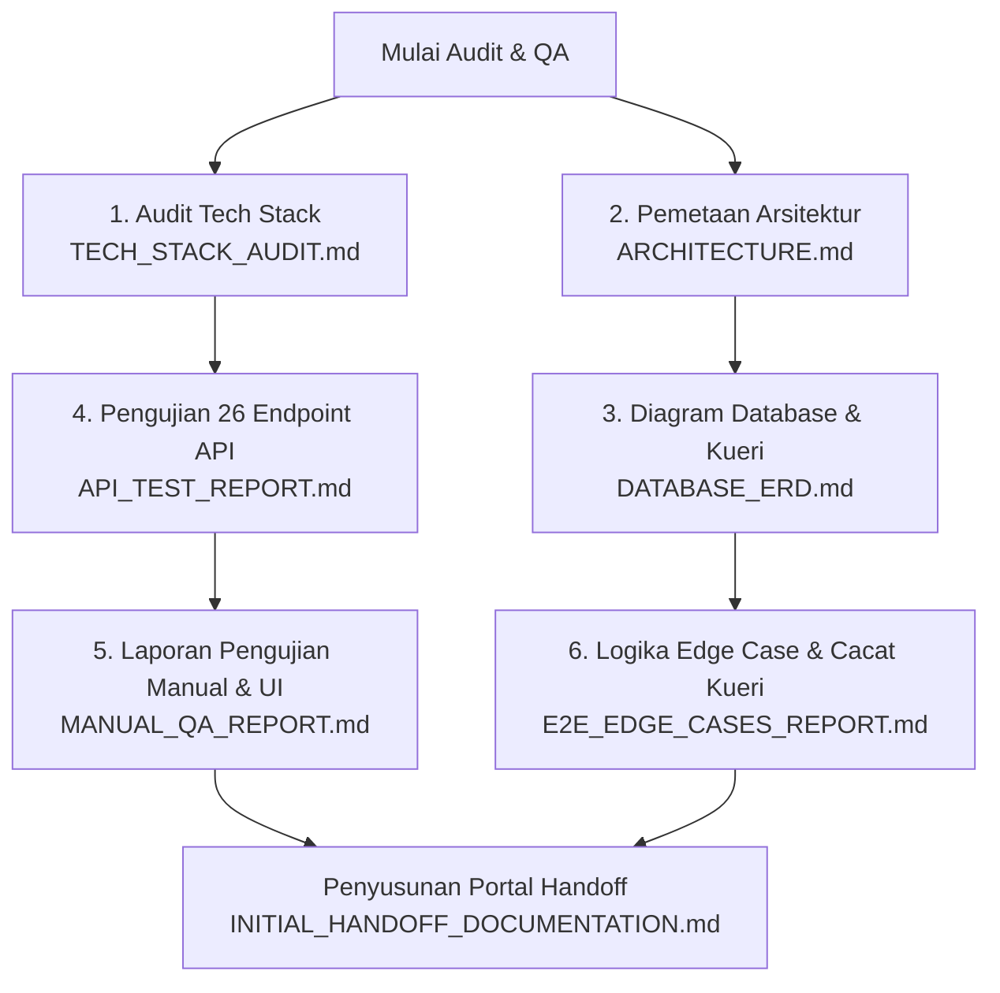

# 🚀 Initial Handoff Documentation (Dokumentasi Serah Terima Awal)
`diskominfo-intern-attendance` | Tanggal: 22 Juni 2026

Selamat datang! Dokumen ini dirancang sebagai **Portal Utama (Entry Point)** untuk developer atau agen AI yang akan melanjutkan pengembangan atau perbaikan sistem absensi peserta magang **Diskominfo Intern Attendance**. 

Hari ini, telah dilakukan audit menyeluruh pada aspek arsitektur, basis data, keamanan, performa API, hingga kecocokan UI/UX. Semua hasil audit dan pengujian telah disimpan ke dalam file-file dokumentasi khusus di bawah ini.

---

## 📂 Peta Dokumen Serah Terima (Handoff Directory)

Gunakan tabel di bawah ini untuk menavigasi seluruh laporan pengujian, audit, dan diagram yang telah dibuat hari ini:

| # | Dokumen & Laporan | Tautan File | Deskripsi & Cakupan |
| :--- | :--- | :--- | :--- |
| 1 | **Codebase Architecture Mapping** | [ARCHITECTURE.md](file:///d:/Intern%20Pangeran/coding-absensi-bebas/diskominfo-intern-attendance/ARCHITECTURE.md) | Pemetaan struktur folder Next.js App Router, pola aliran data (UI ➔ Zustand ➔ Service ➔ Controller ➔ DB), aturan JSDoc & JSDoc rules, serta aturan CASL Ability. |
| 2 | **Tech Stack Audit** | [TECH_STACK_AUDIT.md](file:///d:/Intern%20Pangeran/coding-absensi-bebas/diskominfo-intern-attendance/TECH_STACK_AUDIT.md) | Penilaian versi Next.js, Tailwind v4, Prisma, Better-Auth, dan dependensi krusial lainnya beserta evaluasi kesiapan produksi. |
| 3 | **Manual QA & UI/UX Audit** | [MANUAL_QA_REPORT.md](file:///d:/Intern%20Pangeran/coding-absensi-bebas/diskominfo-intern-attendance/MANUAL_QA_REPORT.md) | Laporan detail pengujian fungsionalitas (database, rute proteksi, peta Leaflet, dialog admin, email, dan anomali visual landing page). |
| 4 | **Entity Relationship Diagram (ERD)** | [DATABASE_ERD.md](file:///d:/Intern%20Pangeran/coding-absensi-bebas/diskominfo-intern-attendance/DATABASE_ERD.md) | Diagram visual relasi tabel PostgreSQL (Mermaid) dan analisis kueri untuk pencegahan kesalahan laporan bulanan. |
| 5 | **E2E & Edge Case Report** | [E2E_EDGE_CASES_REPORT.md](file:///d:/Intern%20Pangeran/coding-absensi-bebas/diskominfo-intern-attendance/E2E_EDGE_CASES_REPORT.md) | Laporan uji kasus batas (double click submission, regex date validation loop, cacat logika kueri libur instansi, serta usulan middleware/helper `withAuth`). |
| 6 | **Automated API Test Report** | [API_TEST_REPORT.md](file:///d:/Intern%20Pangeran/coding-absensi-bebas/diskominfo-intern-attendance/API_TEST_REPORT.md) | Laporan status code dan waktu respons (ms) dari hasil eksekusi uji coba 26/26 endpoint API secara otomatis. |
| 7 | **Folder Alat Uji (Scripts)** | [scratch/](file:///d:/Intern%20Pangeran/coding-absensi-bebas/diskominfo-intern-attendance/scratch) | Kumpulan script JavaScript sekali pakai untuk mensimulasikan GPS Spoofing, pengujian massal API, dll. |

---

## 🎯 Hubungan Antar Dokumen & Siklus Audit

Bagan di bawah ini menunjukkan bagaimana setiap dokumen saling melengkapi untuk membentuk pemahaman sistem yang utuh:



---

## ⚠️ Temuan Kritis yang Memerlukan Tindakan Cepat (Critical Checklist)

Berdasarkan seluruh proses pengujian, berikut adalah rangkuman masalah paling serius yang ditemukan dan harus segera diperbaiki oleh tim developer selanjutnya:

### 1. Keamanan Biometrik (Sangat Tinggi / High Priority)
* **Masalah:** Verifikasi wajah menggunakan library `face-api.js` di browser tidak memiliki liveness detection (*anti-spoofing*). Seseorang dapat absen menggunakan foto cetak atau layar HP orang lain.
* **Tindakan:** Terapkan perhitungan **EAR (Eye Aspect Ratio)** di frontend untuk mendeteksi kedipan mata nyata sebelum absen diterima.
* **Detail Rujukan:** [MANUAL_QA_REPORT.md Section 6](file:///d:/Intern%20Pangeran/coding-absensi-bebas/diskominfo-intern-attendance/MANUAL_QA_REPORT.md#L147) & [E2E_EDGE_CASES_REPORT.md Section 4](file:///d:/Intern%20Pangeran/coding-absensi-bebas/diskominfo-intern-attendance/E2E_EDGE_CASES_REPORT.md#L201).

### 2. Cacat Logika Kueri Hari Libur (Sangat Tinggi / High Priority)
* **Masalah:** API absensi mencari hari libur secara global (`prisma.agencyHoliday.findFirst`) tanpa menyaring `agencyId`. Hari libur di Instansi A akan memblokir absensi interns di Instansi B dan C.
* **Tindakan:** Tambahkan filter `agencyId: intern.agencyId` pada pencarian hari libur di `app/api/attendances/route.ts`.
* **Detail Rujukan:** [E2E_EDGE_CASES_REPORT.md Section 4](file:///d:/Intern%20Pangeran/coding-absensi-bebas/diskominfo-intern-attendance/E2E_EDGE_CASES_REPORT.md#L201).

### 3. Validasi Loophole Tanggal Kalender (Tinggi / Medium-High Priority)
* **Masalah:** Schema Zod mendeteksi pola format string `"YYYY-MM-DD"`, namun tidak mengecek validitas kalender (misal: `"2026-09-99"` lolos dan tersimpan di database). Ini memicu `Invalid Date` yang merusak laporan bulanan Excel dan kalender UI.
* **Tindakan:** Tambahkan `.refine()` pada Zod untuk memvalidasi kelayakan tanggal.
* **Detail Rujukan:** [E2E_EDGE_CASES_REPORT.md Section 2](file:///d:/Intern%20Pangeran/coding-absensi-bebas/diskominfo-intern-attendance/E2E_EDGE_CASES_REPORT.md#L7) & [DATABASE_ERD.md Section 2](file:///d:/Intern%20Pangeran/coding-absensi-bebas/diskominfo-intern-attendance/DATABASE_ERD.md#L214).

### 4. Response HTTP 500 saat Double-Click (Sedang / Medium Priority)
* **Masalah:** Jika absensi ditekan 2x cepat, database memblokir dengan *unique constraint violation*, namun server membalas dengan status 500 (Internal Server Error) karena tidak adanya try-catch prisma error code `P2002`.
* **Tindakan:** Tangkap kode error `P2002` di backend, lalu kembalikan respons HTTP 409 Conflict.
* **Detail Rujukan:** [E2E_EDGE_CASES_REPORT.md Section 1](file:///d:/Intern%20Pangeran/coding-absensi-bebas/diskominfo-intern-attendance/E2E_EDGE_CASES_REPORT.md#L1).

---

## 🛠️ Cara Menjalankan Alat Uji (Scratch Scripts)

Di dalam folder `/scratch`, terdapat beberapa alat bantu pengujian yang dapat dijalankan secara langsung lewat terminal menggunakan Node.js:

1. **Uji Coba API Otomatis:**
   * **Script:** [`scratch/test_apis.js`](file:///d:/Intern%20Pangeran/coding-absensi-bebas/diskominfo-intern-attendance/scratch/test_apis.js)
   * **Deskripsi:** Menguji 26 endpoint aplikasi absensi dengan memverifikasi kode status respons HTTP.
   * **Cara Menjalankan:**
     ```bash
     node scratch/test_apis.js
     ```

2. **Uji Coba GPS Spoofing & Velocity:**
   * **Script:** [`scratch/test_gps_spoofing.js`](file:///d:/Intern%20Pangeran/coding-absensi-bebas/diskominfo-intern-attendance/scratch/test_gps_spoofing.js)
   * **Deskripsi:** Mensimulasikan absensi dari luar area polygon geofencing dan mensimulasikan perpindahan lokasi cepat (*velocity spoofing*).
   * **Cara Menjalankan:**
     ```bash
     node scratch/test_gps_spoofing.js
     ```

---

Semua dokumen di atas terstruktur secara modular. Developer selanjutnya disarankan untuk memulai perbaikan dari **Cacat Logika Kueri Hari Libur (No. 2)** karena dampaknya yang memblokir absensi karyawan secara lintas-instansi, diikuti oleh **Validasi Zod Tanggal (No. 3)** untuk mengamankan data reporting.
